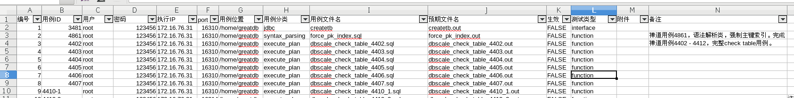
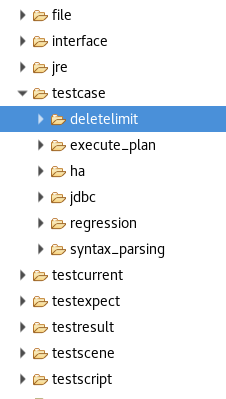
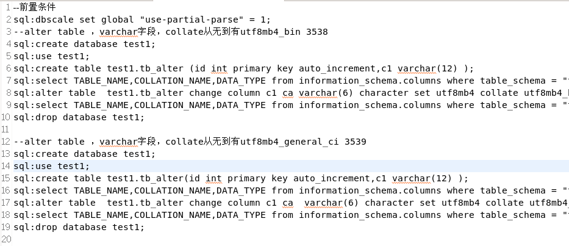
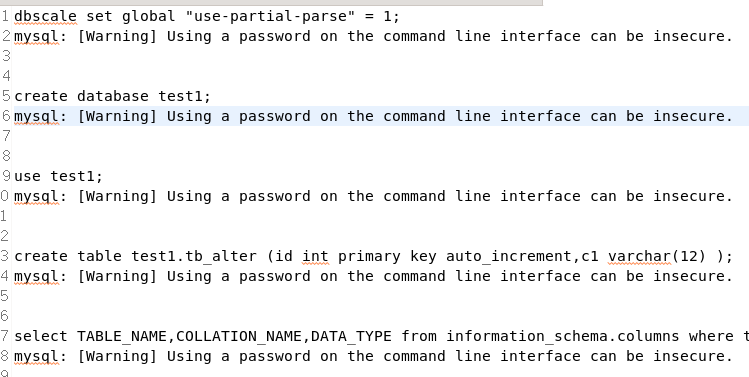
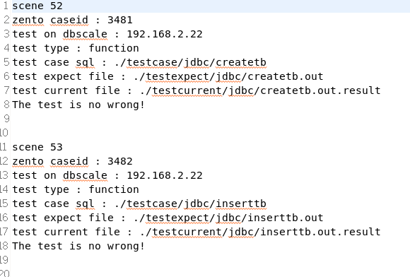
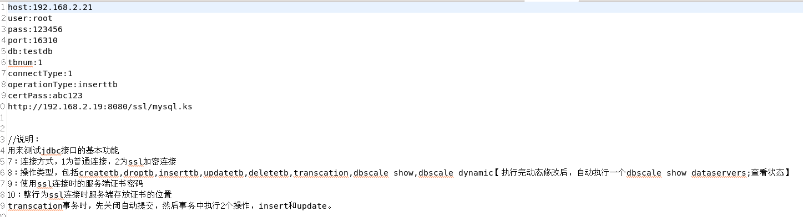
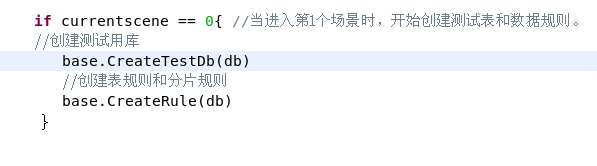

# Dbscale 自动化测试工具

## 一 概述

本工具用来自动化测试dbscale集群，其中包含基本功能测试，接口测试，部分高可用测试，性能测试，稳定性测试等。

使用修改配置文件，直接对正在运行的集群发起测试，通过编辑场景文件，调度测试内容，最后在结果文件中查看本次测试结果。


## 二 基本使用方法

### 1 设置配置文件

bin/file/properties文件为整个测试工具的基本配置文件：

```
USER=greatdb  --执行某些操作时，主机上的普通用户
PASSWORD=abc123	--普通用户的密码
ROOTPASS=abc123	--root密码
#控制节点数量，控制节点所在主机。
DBSCALE_HOST=172.16.76.31,172.16.76.32,172.16.76.33,172.16.76.34 --集群中所有dbscale主机的ip
ALL_HOST=172.16.76.31,172.16.76.32,172.16.76.33,172.16.76.34 --集群中所有主机的ip
#节点端测试运行根目录
TESTROOT=/data	--创建测试环境的根目录
#节点端测试目录
TESTPATH=/dbscaleAutoTest	--测试工具安装目录
DBSCALEPORT=16310	--默认dbscale端口
DBSCALEPASS=Abc@1234	--默认dbscale密码
GEPATH=/data/ge	--预期文件的工作目录
```

### 2 场景文件说明

bin/testscene/testsceneinfo.csv，为执行中的场景调度文件【后期可以将调度文件拆分，根据执行分类或执行计划灵活使用】：



|  字段   |            说明            |                    备注                    |
| :---: | :----------------------: | :--------------------------------------: |
|  编号   | 场景文件每行的编号，记录当前csv文件中的信息。 |                                          |
| 用例ID  |       关联禅道上该用例的ID        |            若一行执行多条用例，可用范围标记。             |
|  用户   |       默认为连接数据库的用户        |                                          |
|  密码   |      默认为连接数据库的用户密码       |                                          |
| 执行IP  |    当前行的执行内容预计在哪个主机上执行    |                                          |
| PORT  |        运行时主机对应的端口        |                                          |
| 用例位置  |          /*暂留*/          |                                          |
| 用例分类  |      对应禅道上项目相关的模块名       |               测试工具端用来分类用例                |
| 用例文件名 |    存放在分类下不同目录中的sql文件     |                 被用来直接执行                  |
| 预期文件  |    存放在分类下不同目录中的out文件     |        前期使用ge工具生成的某个sql文件执行的结果文件         |
|  生效   |         当前行是否被执行         |             FALSE不执行，TRUE执行。             |
| 测试类型  |         测试执行的分类          | function为普通sql测试，interface为接口测试，ifcontrol为高可用的断网测试，disable为高可用的禁用测试，kill15为高可用的杀进程测试 |
|  附件   |          附件文件名           | 若用例中有附加文件的需要，此处标记文件名，实际文件存放在bin/file/模块分类 下 |

### 3 功能测试步骤

#### a 在工具端创建分类及目录




执行的默认目录包括：

testcase，存放测试用例

testcurrent，存放本次执行的实际结果

testexpect，存放对应用例的预期文件

执行某个功能测试，需要在以上3个目录中创建相同的模块目录，表明一个完整的测试需要每个位置一一对应。

例如上图中，testcase下的syntax_parsing，存放的是禅道上项目模块的语法解析功能的用例，同样需要在testcurrent和textexpect下再建syntax_parsing，syntax_parsing存放在sceneinfo.csv的用例分类。

#### b 创建功能测试sql文件

功能测试的sql文件，文件名没有严格限制，主要是能标记测试的功能，禅道上用例编号等简单信息即可。



具体的sql文件里，

以“--”开头的内容被视为注释字段

以“sql:”开头的内容为执行的实际sql语句，这个语句要通过 -e 的方式发给mysql执行。

此处保留其他执行类型语句的方法，例如事务性操作等。

#### c 创建预期文件

执行功能自动化测试前，要对已有的sql文件生成对应的预期文件。

bin/ge文件用来生成需要的预期文件，ge有两种运行方式：

```
./ge ./testcase/mod/test1.sql 执行脚本中不用上传附件的方式
./ge ./testcase/mod/test1.sql  pathcfile 执行脚本需要上传附件，自动传入/tmp下，实际执行时注意修改预期文件和结果文件中附件的位置。
```

注意，此处实际是通过perproties里第一个dbscale的主机，执行了一遍sql文件，然后把执行结果放到了该主机的/tmp下，如果在执行中有ip等变化信息，或需要适应自动化运行环境的情况，可能要重新生成预期文件。

另外如果sql文件能确保无误，可以通过ge做半自动的手工测试。

确认生成的预期文件（out文件）无误后，需要传回运行工具的bin/testexpect目录对应的模块下，注意sql文件和out文件的名称主体部分要一致。



生成预期文件实际是使用mysql -e 'file.sql' > file.out的方式（实际执行测试时实际也是用的这个方法），所以生成的结果内容和登录client执行还是不一样的，需要根据实际情况调整用例执行的内容，以显示出具体结果。

#### d 在场景文件中配置该测试

注意sceneinfo.csv中的每个字段要和具体情况一一对应。

#### e 开始执行测试

执行bin/cluster4test，就会自动读取场景文件中状态为TRUE的行，根据实际情况执行测试。

#### f 收集测试结果 

执行完本轮测试后，会把所有本次执行的内容存放到bin/testcurrent/模块下，同时会使用out文件和取回来的文件做逐行文本对比，若发现不一致，则记为当前用例测试异常，并在最终结果文件中标记预期文件和实际文件不一样的行。



由上图可见，按场景序号分类，对应显示该用例在禅道的用例编号，执行测试时使用的dbscale主机，测试类型，执行的sql文件等内容，若测试出现了异常，还会显示异常语句的实际情况和预期情况。

#### g 清理测试环境

每一轮测试完成后，会在bin/testresult目录下生成一个myresult文件，执行bin/cleantest，会做测试环境清理：

##### i 将本轮测试的current下的文件删除（之后可保留或按一定方式备份）

##### ii 将执行端所有节点下的测试目录删除

##### iii 将工具端bin/testresult目录下的myresult修改为myresult+时间戳


### 4 接口测试步骤

#### a 接口测试的分类

目前这部分只包含jdbc的测试，包括基本操作等，接口工具还可以进一步完善。目标是使当前工具的接口测试能够涵盖包括java、c、py、go等绝大多数应用支持的主流接口覆盖，确保每个dbscale的发布版本对这些接口和应用环境有比较正常的运行状态。

#### b 接口测试的启用


sceneinfo的记录中，测试类型选择interface，用例分类选择jdbc。

此时的用例文件名和功能测试的时候有有所不同，不再是sql文件，打开发现实际是一个配置文件，这个是接口工具执行时读取的配置。



根据需要的测试内容配置集群访问目录，用户信息等，当前jdbc访问支持普通连接和ssl加密连接方式（使用加密连接需要在被访问端开通tomcat的证书服务）。

预期文件的部分仍然以out为扩展名，此处的预期文件使用和功能测试基本一致，只不过生成预期文件的时候是直接用bin/interface/testMysqlJdbc.jar 来生成，实际测试也是out文件和当前运行的文件比较，需要注意的是jdbc的输出内容全在jar文件内的定义，为表明执行状态，需要调整jar的输出（详细可以在实际使用时进一步维护）。

#### c 接口测试的执行

当sceneinfo.csv中对应的配置全部调整好后，开始运行测试。

首先工具本地的bin/jre包含了一个1.8版本的java运行环境，jdbc测试的运行都是利用本地环境里的jre调用testMysqlJdbc.jar，加载每个场景的配置，然后在本地的current目录里收集该测试的实际结果，再和expect目录里的预期文件做对比。

#### d 接口测试的结果统计

有了实际测试结果和预期文件，和功能测试相同，也是做文本的逐行对比，结果统计和收集等和功能测试一致。

#### e 其他应用接口的测试

【位置暂留，等待补充其他接口测试方案。】

### 5 高可用测试

#### a 高可用测试的分类

目前测试工具里支持三类高可用场景，i 对mysql实例的kill类操作，ii 对某个主机上的网络断开服务，iii 对某个dataserver的disable操作。

#### b 高可用环境状态

测试高可用时，为了模拟想对真实的运行环境，需要提前做两个准备：

##### 	i 在指定数据源上创建需要的建表规则：



​	在程序主线上，判断当进入场景0时，开始执行建库和创建表规则步骤，这里的库是之后sysbench用到的库和表，暂定库名testdb，然后分别在global_ds，normal_0，part_0，part_1，part_2，上分别创建规则;

```
dbscale dynamic add normal_table dataspace testdb.sbtest1 datasource = "global_ds";

dbscale dynamic add normal_table dataspace testdb.sbtest2 datasource = "normal_0";

dbscale dynamic add hash_type partition_scheme "hash-mod-sh"  partition="part_2" partition="part_1" partition="part_0"  is_shard shard_nums 12;

dbscale dynamic add partition_table dataspace testdb.sbtest3 partition_key="id" partition_scheme="hash-mod-sh";
```

暂时只建3个表。

##### ii 在执行高可用的同时，运行一套sysbench的加压进程：

库、规则建好后，需要使用sysbench做初始化和启动加压，这里同样使用sceneinfo.csv中的记录作为控制：


记录中测试类型使用"sysbench"，表示当前行为测试工具sysbench的相关操作。

和其他记录行一样，保证正常运行，需要在“用例文件名”和“预期文件名”中填写适当的内容，测试工具一类的文件，放在tool分类目录下。

用例文件和预期文件的内容目前可以为空，但文件名包含具体含义，例如“init-oltp_read_write-50000-32.sql”表示：

执行sysbench的init操作，使用oltp_read_write脚本，32线程，每个表50000条记录，当然表的数量默认为3个，以配合前面规则创建时候的设置。

“run-oltp_read_write-50000-32-3600.sql”则表示：

执行sysbench的run操作，使用oltp_read_write脚本，32线程，每个表50000条记录，持续执行3600秒。【运行run时使用go启动一个协程，并没有判断执行状态的结束，所以run到时后sysbench不结束，而是持续运行但业务数据为全0，所以这里sysbench只能作为高可用加压和过程中业务状态的参考，最后暂时没办法有统计信息。】

在所有需要的场景结束后，安排一个“stop-oltp_read_write-50000-32-3600.sql”场景，这里只要stop这个phase关键字，会自动执行本地sysbench的kill -9操作，结束sysbench进程。

【之后会将sysbench的操作扩展到性能测试的部分，但是要考虑解决协程（可能由协程导致）不结束而sysbench不结束所有没有统计信息的情况。

另外会增加sysbench执行过程中的数据清洗功能，将固定打印出来的内容做清洗，当tps或qps之类的数据出现异常，直接跳出提示。

】

##### iii sysbench说明：

加压的sysbench是放在执行工具本地的sysbench目录下，里面包含了运行时需要的lib文件，每次执行时会在执行环境export，保证能够正确执行，init和run的过程会以文档的模式存放在sysbench/record下，文件名为该次启动的场景等信息，以方便查看。


#### c kill实例场景的说明

sceneinfo.csv中，测试类型为ha，用例分类为kill15，


用例文件名和预期文件名同样遵循文件名主体一致的原则，但高可用场景的用例文件名与预期文件名的每个字段都有特殊的含义，例如kill-16313-master-10.sql：

- kill：表示为杀实例用例，但运行中这个字段没有实际意义；


- 16313：表示要杀端口号为16313上的实例；


- master：表示当前用例要杀端口号为16313的master角色用例，无论该master在哪个ip的主机上，只要符合条件就执行kill操作；若是slave，则选择杀端口号为16313的最后一个slave角色用例，因为目前对从节点数量不做判断，在查询结果分片长度的时候，记录最后一个值作为被kill的对象。


- 10：表示当前用例执行时，kill10次。

至于用例文件和预期文件的内容，由于高可用场景主要是操作系统状态，然后检查系统表中的集群状态，而且实际运行时很可能状态变化每次都不一样，因此这里的测试结果不能使用文本对比来处理，而是应该通过对集群系统在一定时间内容的还原情况来判断。此处忽略用例文件和预期文件的内容，由工具执行过程中发现的集群中dbscale show datasource type = replication ;中的节点状态是否全部变为Working来决定，若当前场景长时间或几轮检查都不能恢复，则记录该场景的测试异常。

#### d disable集群角色场景的说明

sceneinfo.csv中，测试类型为ha，用例分类为disable，


配置方式和kill实例的场景基本一致，需要特别说明的是用例文件的字段含义，例如“disable-normal-master-10.sql”：

disable：表示当前执行的是disable的高可用场景；

normal：表示当前执行的disable是针对normal这个角色，如果集群中有多个normal，则需要写到normal_0或normal_1，其他角色同理；

master：表示当前执行的disable是针对该角色的master节点进行，循环迭代执行的时候，不管当前master在哪个节点上，只要是master，就被执行disable；

10：表示该场景循环迭代10次；

和kill的场景略有不同，在执行时，系统不会判断当前集群中的节点状态，而是直接开始执行disable，等待10秒，重新执行enable，过程中会使用sysbench不断加压，同时记录sysbench的业务数据有没有问题。


### 6 性能测试

性能测试使用的工具是sysbench，在场景中只需要设置一行即可。


进入该行后，系统自动在测试集群上创建名为stressdb的库，并以此为基础创建规则。

接着自动初始化sysbench的表并执行，和高可用的sysbench压力背景不同，这里操作一步到为，且不使用协程进入后台，必须等待运行完成。执行过程的记录文本同样写入record目录【暂定】。

“stress-oltp_read_write-50000-32-3600.sql”的规则和sysbench压力背景时的run操作基本一致。

【暂留一个问题，由于跨网络等因素，sysbench等性能操作，很可能压力比较低，因此实际测试时应考虑将sysbench的运行目录发往适合的主机，如果可以接受在本地启动，则场景文件的运行主机字段可以写成127.0.0.1或localhost，否则写成要发往的主机信息等。】


### 7 注意事项

【未完待续】